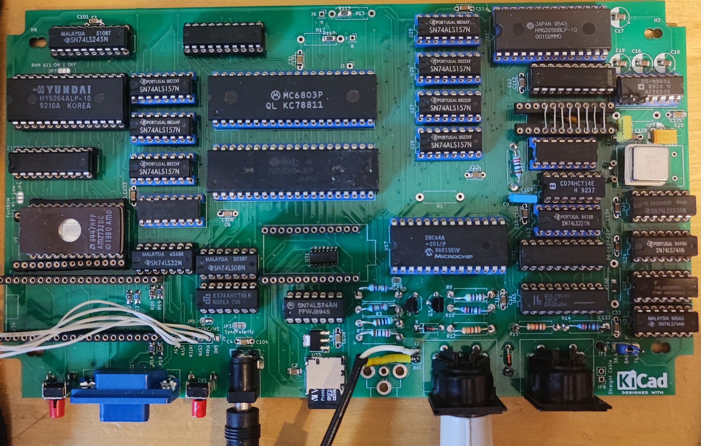

# EVA-1_Reproduction

Recreation of the very rare K-K Systems EVA-1 Display Adapter for the Epson HX-20 Computer

In the folder disassembly are three versions of the original firmware:

* eva_orig: original firmware 
* eva_enh: enhanced firmware (mostly original)
* eva_ext: extended firmware (32k Text RAM, additional functions)
    - see the .asm file for more comments.

The gal folder contains the equations and .jed file for the GAL.

The monitor folder contains a modified version of Daniel Tufvesson's monitor. This is just for testing.

In the rom folder one can find the original rom and the font rom.

The schematics folder contains different versions of the reverse engineering process.

* EVA1: the original reverse engineered schematic and board (NOT FOR PRODUCTION!)
* EVA1_production: the mostly original EVA1 for production (DRAM does NOT work!)
* EVA86-2: from sources on the internet redrawn schematics of the EVA86 (not complete!)
* EVA1_v2: new version with SRAM as Graphic RAM, Arduino as mass storage and RP2040 for VGA Output.
* EVA1_Frontplatte: a drill template for the Strapubox 5003 case

For the newest Hardware Revision (0.5) use the File "disassembly/eva_ext/rom.bin" for a 28C64 or 27C64 ROM.